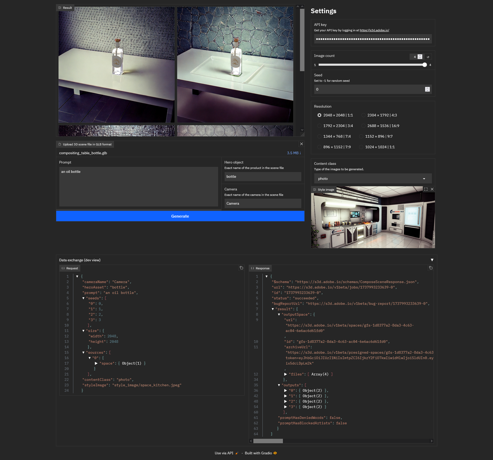

# SubstanceAI-GUI
A gradio-based UI for the private beta test of the Adobe Substance API, focusing on the "Compose generative 2D content with 3D scenes" endpoint.

> [!IMPORTANT]
> This is **still a work in progress** and it is not functional yet. If you see this message, don't expect the project to work out of the box, even if you follow the installation instructions.

## Installation
> [!IMPORTANT]
> In this section it's assumed that you have [Git](https://git-scm.com/), [Python](https://www.python.org/) and [Anaconda](https://www.anaconda.com/download) properly installed on your machine.

Follow these steps to install SubstanceAI GUI:
1. `git clone https://github.com/brayevalerien/SubstanceAI-GUI` (make sure you're logged in because the repository is private, you need to be authentified  as a collaborator to clone it)
2. `cd SubstanceAI-GUI`
3. `conda create -n substanceai-gui -y python=3.12 && conda activate substanceai-gui`
4. `pip install -r requirements.txt`

## Usage
Once you've installed the project, run `python webui.py` to start the UI. Follow these steps to prepare and send your request to the Substance API:
1. Add your API key. You can get your key by logging in [here](https://s3d.adobe.io/v1beta/docs#/) if you are a part of the private Substance API beta test.
2. Load a 3D scene. **IMPORTANT:** Your scene must have been exported as a `.glb` file
3. Write a prompt
4. Write the exact name of the hero object (your product) and the camera you want to use for rendering. Use the names that are used in the scene, otherwise the API will not be able to find your objects.
5. Choose the image count and the seed
6. Set your resolution (note that the resolution set in your scene will be ignored)
7. Send the request by hitting the "Generate" button.

The generation takes from a few seconds to a couple of minutes and the generated image will appear in the main image frame in the middle of the UI.

For debugging purposes, you can inspect what has been sent to the API and what the response by opening the "Data exchange (dev view)".